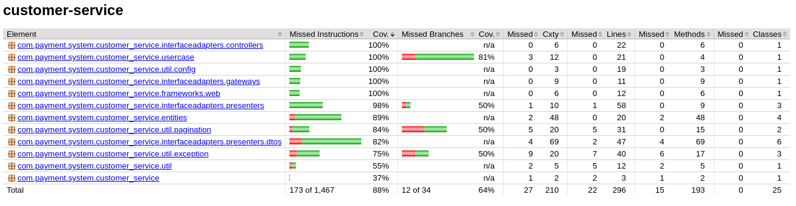

# API para Gerenciamento de Clientes

## Hackathon FIAP

Este repositório refere-se ao microsserviço de clientes. No total, o projeto envolve 4 microsserviços, sendo eles:

1. [Geração de Tokens JWT](https://github.com/AydanAmorim/Hackaton-Users/tree/main)
2. **Cliente** *(este)*
3. [Cartão](https://github.com/erickmatheusribeiro/card-service)
4. [Pagamentos](https://github.com/DFaccio/payment-service)

Também temos o [Gateway](https://github.com/fysabelah/payment-processing-system/tree/main/gateway-with-authentication) e
o [Registro de Serviços](https://github.com/fysabelah/discovery-services/tree/main).

## Principais recursos deste microserviço

Responsável por operações, como:

* Incluir novos clientes;
* Alterar informações;
* Buscar cliente por documento e por identificador
* Buscar todos os clientes de forma paginada

## Tecnologias

* Spring Boot para a estrutura do serviço
* Spring Data JPA para manipulação de dados
* Spring Cloud Stream para comunicação baseada em eventos com outros microsserviços
* PostgreSQL para persistência

## Desenvolvedores

- [Aydan Amorim](https://github.com/AydanAmorim)
- [Danilo Faccio](https://github.com/DFaccio)
- [Erick Ribeiro](https://github.com/erickmatheusribeiro)
- [Isabela França](https://github.com/fysabelah)

## Como configurar

Esta descriação refere-se apenas a execução deste serviço, para mais informações verifique o README.md
do [projeto completo](https://github.com/fysabelah/payment-processing-system).

Devido ao formato de estruturação deste serviço dentro do projeto, será necessário clonar todo o projeto e após abrir na
IDE de sua preferência o projeto.

```
git clone --recursive https://github.com/fysabelah/payment-processing-system.git
```

Crie o arquivo .env dentro do diretório _customer-service_.

```
PROFILE=dev

SWAGGER_SERVER_ADDRESS=http://localhost:7073

DATABASE_USERNAME=postgres
DATABASE_PASSWORD=i@mr00t
DATABASE_HOST=localhost:6062
DATABASE=clients
```

Caso não deseja executar o projeto por completo, ou ao menos a descoberta de serviços ou o gateway, será necessário ao
menos configurar o PostegreSQL.

### Chaves do .env

1. SWAGGER_SERVER_ADDRESS: Apresenta qual servidor será apresentado na documentação do Swagger. Caso o .env não seja
   alterado, a requisição não passará pelo Gateway.
2. DATABASE_: Configurações referentes ao acesso ao PostgreSQL.

Lembrando que os valores serão alterados quando o projeto é executado por completo.

## Documentação

Caso esteja executando apenas este projeto, o Swagger estará disponível em:

* http://localhost:7073/doc
* http://localhost:7073/doc/customer.html

Neste, você encontrará as informações de payload, metódos, retornos, status code e seus significados.

      Caso esteja executando o projeto por completo, a documentação é acessada através do Gateway, desta forma, verifique o README.md do projeto completo.

## Cobertura de Teste com JaCoCo

Alcançando um total de 88% de cobertura incluindo teste de unidade e integração.

